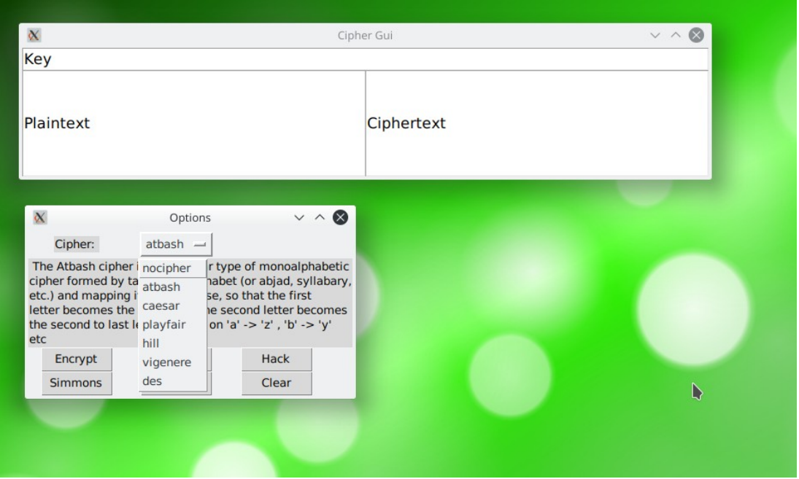

[](https://www.python.org/)<br>
# cipher-gui
Computer Security Assignment __(CSE-537)__ <br>
_Poorly encrypted things_<br>
Currently supports atbash, caesar and vigenere cipher <br>
# Usage
```python3 main.py```
You should open main.py with idle and then run it so that it looks better.

# Demo

