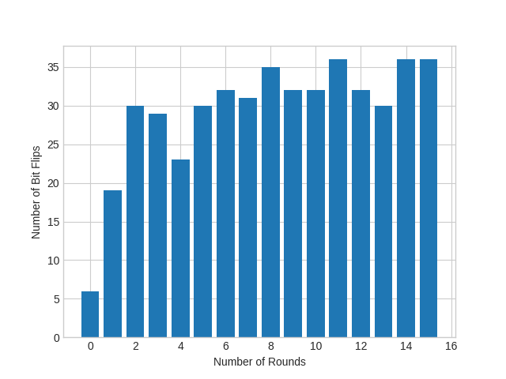

[](https://www.python.org/)
[](https://forthebadge.com)<br>
# cipher-gui
Computer Security Assignment __(CSE-537)__ <br>
_Poorly encrypted things_<br>
Currently supports atbash, caesar and vigenere cipher <br>
Currently  correctness of each algorithm is tested and statistical tests are performed.

# Usage

```python3 main.py```<br>
Gui looks much better if it is run through `idle`.<br>
To test all the algorithms, run<br>
``` python3 test.py``` <br>


# Demo



